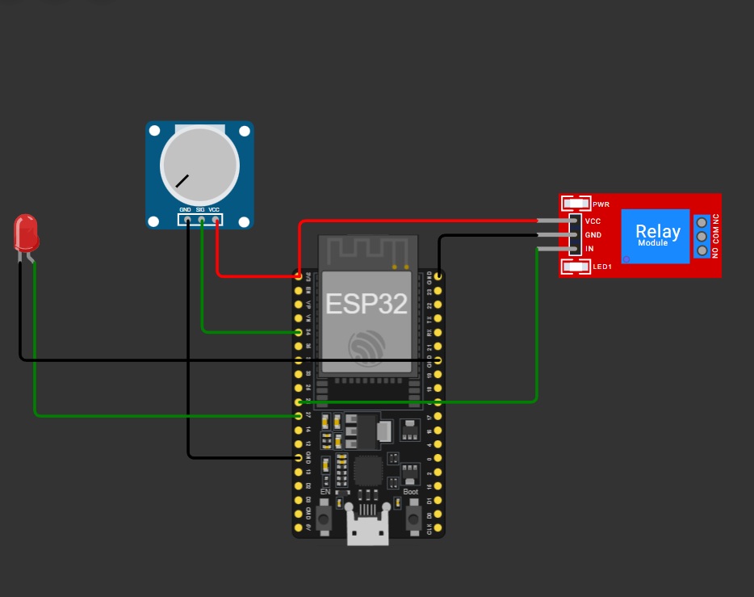
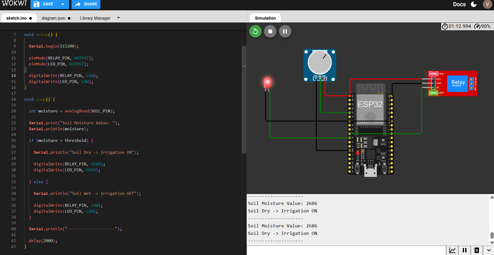
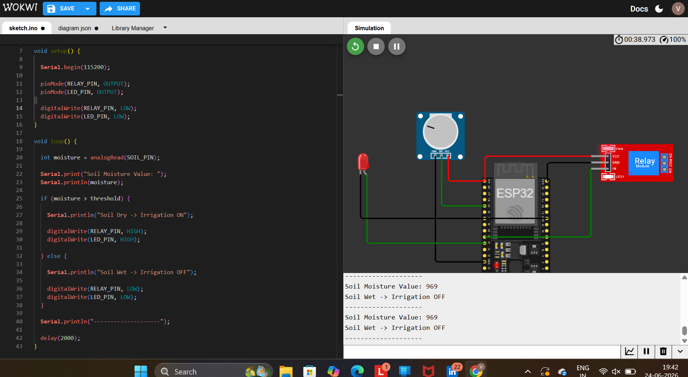

# 🌱 Automated Irrigation Controller

## 📌 Overview

The Automated Irrigation Controller is an IoT-based system that monitors soil moisture levels and automatically controls irrigation.

In this project, a potentiometer is used in Wokwi to simulate soil moisture values. When the soil becomes dry, the relay and pump indicator LED are activated automatically.

## 🎯 Objective

- Monitor soil moisture levels.
- Automate irrigation based on soil condition.
- Demonstrate sensor-to-actuator control logic.

## 🛠 Components Used

- ESP32
- Potentiometer (Soil Moisture Simulation)
- Relay Module
- LED
- Wokwi Simulator

## ⚙️ Working Principle

1. ESP32 reads analog values from the potentiometer.
2. The potentiometer simulates soil moisture.
3. If the moisture value exceeds the threshold:
   - Relay turns ON
   - LED turns ON
   - Irrigation starts
4. Otherwise:
   - Relay turns OFF
   - LED turns OFF
   - Irrigation stops

## 📷 Screenshots

### Circuit Diagram

### Irrigation ON

### Irrigation OFF

## 🔗 Wokwi Simulation

https://wokwi.com/projects/467718968559447041

## 🚀 Learning Outcomes

- IoT Automation
- Analog Sensor Reading
- Relay Control
- Embedded Systems Programming
- ESP32 Development

## 👨‍💻 Author

Vaishnavi Pasham
